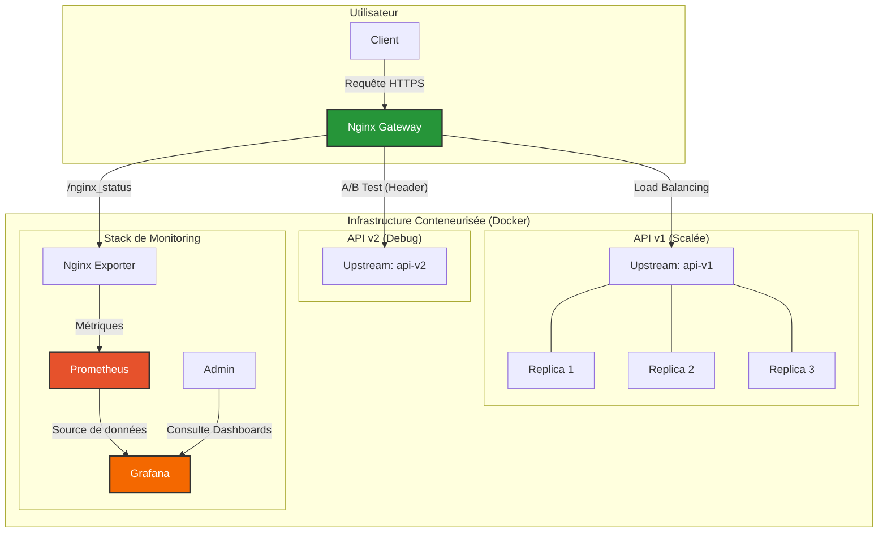

# Solution à l'Examen

## Description des Livrables

La présente archive `.zip` contient :

-   Le présent README_solution.md.
-   **Tous les `Dockerfiles`** nécessaires pour construire les images des services.
-   Le fichier **`docker-compose.yml`** orchestrant tous les services (Nginx, api-v1, api-v2, monitoring).
-   Le fichier **`nginx.conf`** complet avec toutes les directives requises.
-   Les fichiers de configuration et de sécurité (`.htpasswd`, certificats SSL, `prometheus.yml`).
-   Le code source des deux versions de l'API.
-   Un **`Makefile`** avec des commandes claires pour `start-project`, `stop-project`, `test`, `help` (description de la commande).
-   Un script de test (`tests/run_tests.sh`) qui valide automatiquement les fonctionnalités clés.
-   les certificats ont été créés avec les commandes suivantes :

```bash
# creation d'un certificat autosigné
mkdir -p deployments/nginx/certs/
openssl req -x509 -nodes -days 365 -newkey rsa:2048 -keyout deployments/nginx/certs/nginx.key -out deployments/nginx/certs/nginx.crt -subj "/CN=localhost"
# generation d'un fichier user/mot de passe htpasswd (initialisation avec un premier user admin/admin)
htpasswd -cb deployments/nginx/.htpasswd admin admin
```

-   Le tableau de bord grafana NGINX déjà prêt **`NGINX_exporter.json`** et sa configuration associée pour le referencer **`dashboards.yaml`** et connecter son datasource prometheus **`datasource.yaml`**

## Architecture de la solution



## Utilisation

### Prérequis

- Docker et Docker Compose (v1.X pour les commandes docker-compose et non docker compose) installés sur la machine hôte
- `make` disponible dans le PATH
- Ports suivants libres sur la machine :
  - `443` pour l'API via Nginx (HTTPS)
  - `8080` éventuel si redirection alternative
  - `9090` pour Prometheus
  - `3000` pour Grafana

### Commandes générales

```bash
# démarrage
make start-project

# lancement de la batterie de test d'intégration
make test

# arrêt complet
make stop-project

